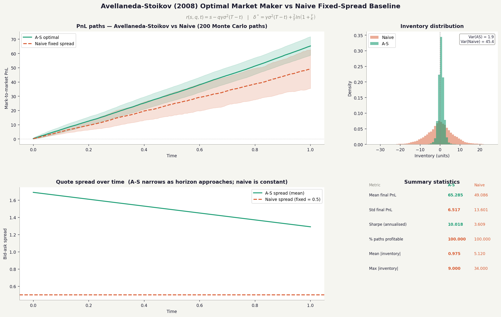
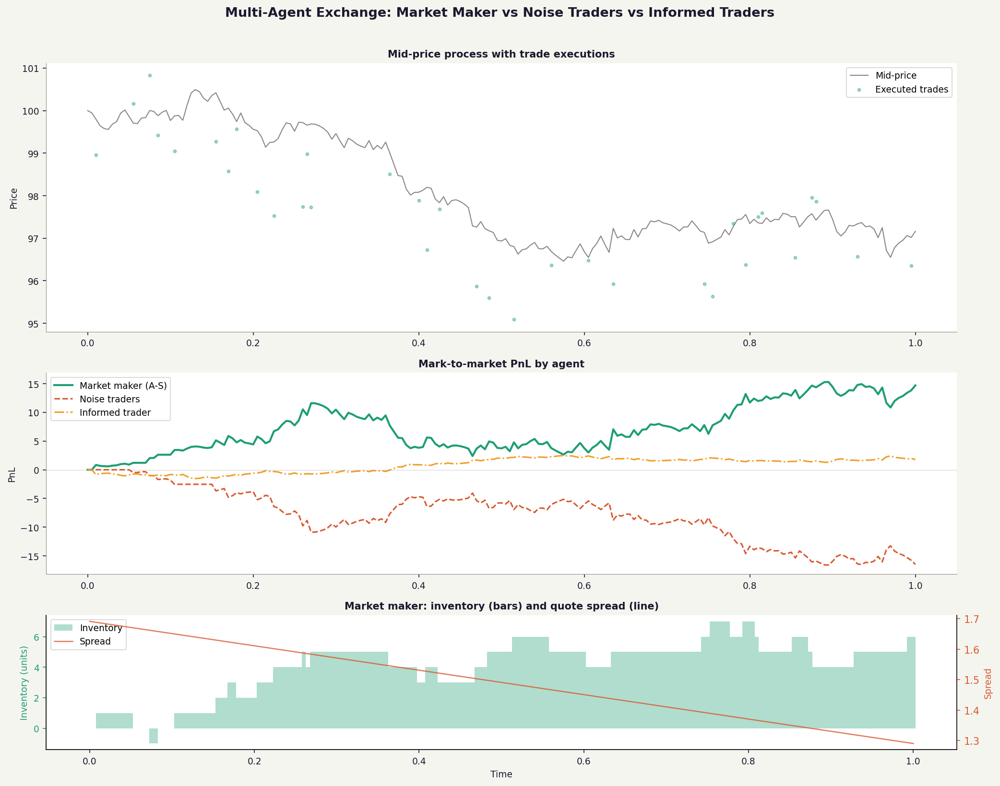
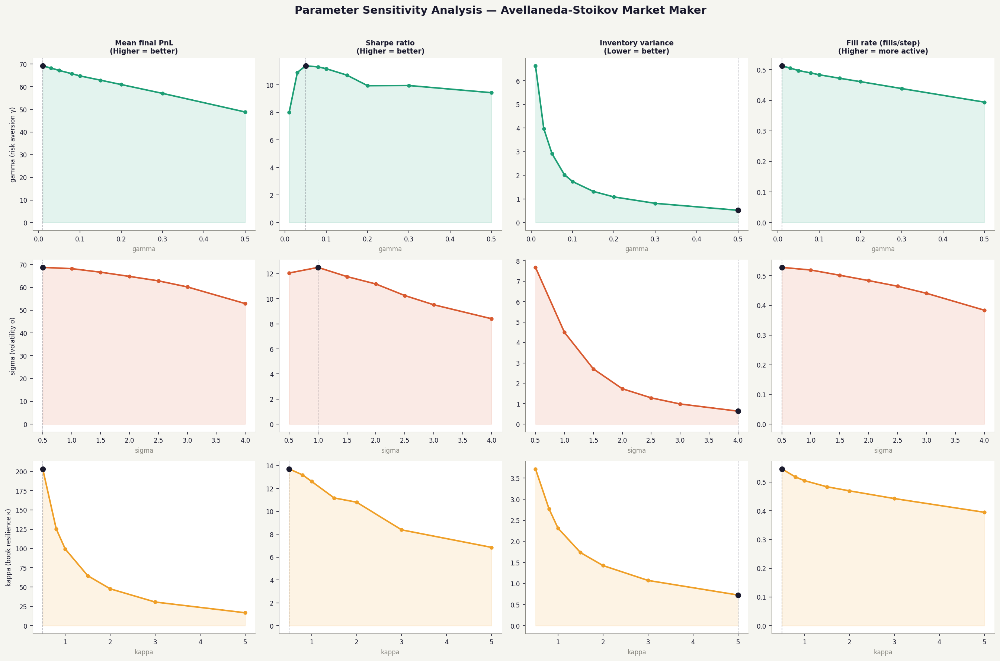

# Avellaneda-Stoikov Optimal Market Maker

Implementation of the closed-form optimal market-making strategy from:

> Avellaneda, M. & Stoikov, S. (2008). *High-frequency trading in a limit order book.*
> Quantitative Finance, 8(3), 217–224.

The paper solves a stochastic optimal control problem to find bid/ask quotes that
maximise CARA utility over a finite horizon — managing both fill probability and
inventory risk. This repo implements the full model, a limit order book with a
matching engine, a multi-agent exchange simulation, and a parameter sensitivity sweep.

---

## The problem

A market maker posts bid and ask quotes continuously. Two risks compete:

1. **Adverse selection** — quoting too tight means informed traders fill you before the price moves against your position.
2. **Inventory risk** — asymmetric fills accumulate a directional position that bleeds PnL.

A naive strategy (`bid = mid − δ`, `ask = mid + δ` for fixed `δ`) ignores both.
The A-S solution prices these risks using stochastic optimal control.

---

## The math

Mid-price follows arithmetic Brownian motion:

$$dS_t = \sigma \, dW_t$$

Order arrivals are Poisson processes with intensity decaying exponentially in quote distance:

$$\lambda(\delta) = A \, e^{-\kappa \delta}$$

The market maker maximises expected CARA utility of terminal wealth:

$$\max_{\delta^b, \delta^a} \; \mathbb{E}\!\left[-e^{-\gamma(W_T + q_T S_T)}\right]$$

### Result 1 — Reservation price (Eq. 7)

$$r(s, q, t) = s - q \gamma \sigma^2 (T - t)$$

When long (`q > 0`), the indifference price sits **below** the mid. The quote pair
shifts downward to discourage buying and incentivise selling. The penalty grows with
risk-aversion `γ`, volatility `σ²`, and time remaining `(T−t)`.

### Result 2 — Optimal spread (Eq. 13)

$$\delta^* = \gamma \sigma^2 (T - t) + \frac{2}{\gamma} \ln\!\left(1 + \frac{\gamma}{\kappa}\right)$$

Two components:
- `γσ²(T−t)`: widens with volatility and time remaining
- `(2/γ) ln(1 + γ/κ)`: minimum spread to break even against adverse selection given book depth `κ`

Quotes are placed symmetrically around the reservation price (not the mid):

$$\text{bid} = r - \delta^*/2, \qquad \text{ask} = r + \delta^*/2$$

Key insight: inventory control **shifts** the quote pair; it does not widen the spread asymmetrically.

---

## Project structure

```
avellaneda_stoikov/
├── core/
│   ├── market.py              # Brownian motion + Poisson order arrival model
│   └── order_book.py          # Limit order book: price-time priority, FIFO matching
├── strategies/
│   ├── avellaneda_stoikov.py  # Closed-form optimal quotes (Eq. 7 & 13)
│   └── naive.py               # Fixed-spread baseline
├── simulation/
│   ├── engine.py              # MC simulator: any strategy, full state history
│   └── exchange.py            # Multi-agent exchange: noise + informed traders
├── tests/
│   ├── test_order_book.py     # 26 tests: matching, FIFO, cancellation, invariants
│   └── test_strategy.py       # 23 tests: closed-form math + 6300-combo sweep
├── results/
│   ├── tearsheet.png          # A-S vs Naive (200 MC paths)
│   ├── exchange.png           # Multi-agent simulation
│   └── sensitivity.png        # Parameter sweep: gamma, sigma, kappa
├── run_comparison.py
├── run_exchange.py
├── sensitivity.py
└── run_all.py                 # Runs everything
```

---

## Results

### A-S vs Naive — 200 Monte Carlo paths



| Metric | A-S optimal | Naive (fixed δ=0.5) |
|---|---|---|
| Mean final PnL | **65.3** | 49.1 |
| Std final PnL | **6.5** | 13.6 |
| Sharpe ratio | **10.0** | 3.6 |
| % paths profitable | 100% | 100% |
| Mean \|inventory\| | **0.97** | 5.12 |
| Max \|inventory\| | **9** | 34 |

A-S achieves **2.8× higher Sharpe** and **5× lower inventory exposure** versus the naive baseline.

### Multi-agent exchange



The market maker extracts profit from noise traders (random direction) while limiting
losses to informed traders (directional signal). Over 50 paths:

| Agent | Mean PnL | Profitable paths |
|---|---|---|
| Market maker (A-S) | +3.67 | 90% |
| Noise traders | −4.04 | 26% |
| Informed traders | +0.37 | 60% |

### Parameter sensitivity



- **γ**: higher risk aversion improves inventory control but reduces fills; PnL peaks around γ=0.05–0.1
- **σ**: PnL increases with volatility (wider optimal spread); inventory risk spikes above σ=3
- **κ**: fill rate collapses as the book thins (high κ); PnL drops sharply above κ=3

---

## Design decisions

**Why separate `reservation_price` and `optimal_spread`?**
The two A-S outputs are independent: where the quote centre sits (inventory-driven)
vs. how wide the quotes are (time/volatility-driven). Separating them allows each
to be tested in isolation and makes ablation studies easy.

**Why arithmetic Brownian motion?**
A-S 2008 uses ABM, which yields an exact closed-form solution. For short horizons
the drift term is negligible and the distinction from GBM is minor.

**Why price-time priority in the order book?**
Standard in all major venues. FIFO within price level makes queue position
deterministic — necessary for strategy correctness proofs.

**Why hard-bound inventory?**
The paper has no inventory constraint. Real market makers always operate with hard
limits; without them, adversarial paths produce unbounded positions.

---

## Running it

```bash
pip install numpy scipy pandas matplotlib

python tests/test_order_book.py   # 26 tests
python tests/test_strategy.py     # 23 tests

python run_comparison.py          # tearsheet.png
python run_exchange.py            # exchange.png
python sensitivity.py             # sensitivity.png

python run_all.py                 # everything at once
```

---

## References

- Avellaneda, M. & Stoikov, S. (2008). High-frequency trading in a limit order book. *Quantitative Finance*, 8(3), 217–224.
- Cartea, Á., Jaimungal, S. & Penalva, J. (2015). *Algorithmic and High-Frequency Trading*. Cambridge. (Chapter 10 extends A-S to multiple assets.)
- Guéant, O. (2017). Optimal market making. *Applied Mathematical Finance*, 24(2), 112–154.
- Ho, T. & Stoll, H. (1981). Optimal dealer pricing under transactions and return uncertainty. *Journal of Financial Economics*, 9(1), 47–73.
